<table align="center" width="1152" cellpadding="0" cellspacing="0" border="0">
  <tr>
    <td colspan="3" width="1152">
      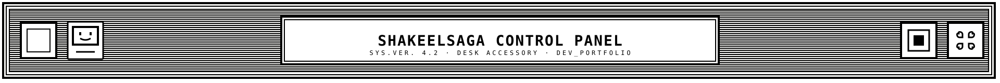
    </td>
  </tr>
  <tr>
    <td width="384" valign="top">
      
    </td>
    <td width="384" valign="top">
      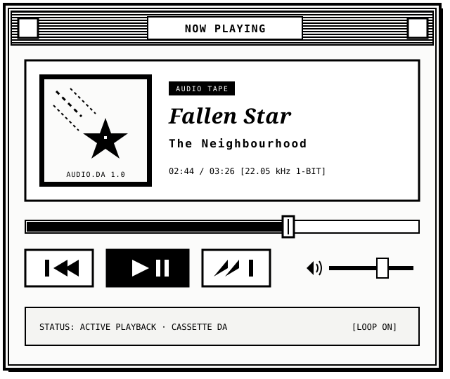
    </td>
    <td width="384" valign="top">
      
    </td>
  </tr>
  <tr>
    <td width="384" valign="top">
      <table width="384" cellpadding="0" cellspacing="0" border="0">
        <tr>
          <td width="384">
            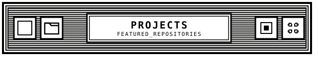
          </td>
        </tr>
        <tr>
          <td width="384">
            <a href="https://github.com/shakeelsaga/V.O.I.D">
              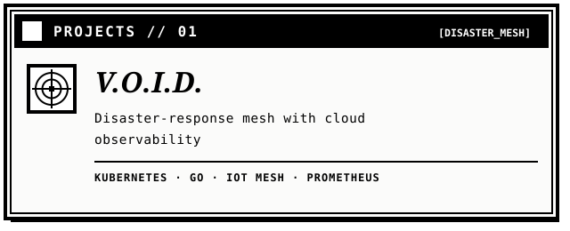
            </a>
          </td>
        </tr>
        <tr>
          <td width="384">
            <a href="https://github.com/shakeelsaga/LogiPredict">
              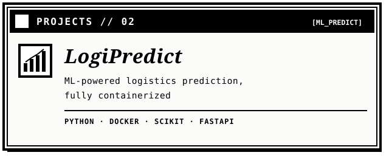
            </a>
          </td>
        </tr>
        <tr>
          <td width="384">
            <a href="https://github.com/shakeelsaga/Serverless-Functions-Collection">
              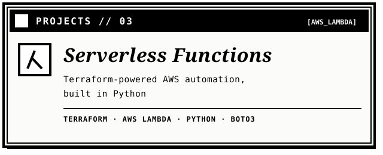
            </a>
          </td>
        </tr>
        <tr>
          <td width="384">
            <a href="https://github.com/shakeelsaga/CloudPail">
              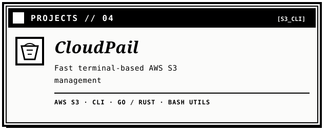
            </a>
          </td>
        </tr>
      </table>
    </td>
    <td width="768" valign="top" colspan="2">
      <table width="768" cellpadding="0" cellspacing="0" border="0">
        <tr>
          <td width="768">
            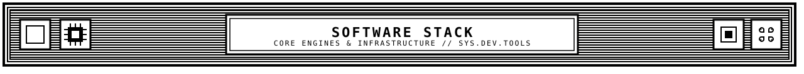
          </td>
        </tr>
        <tr>
          <td width="768">
            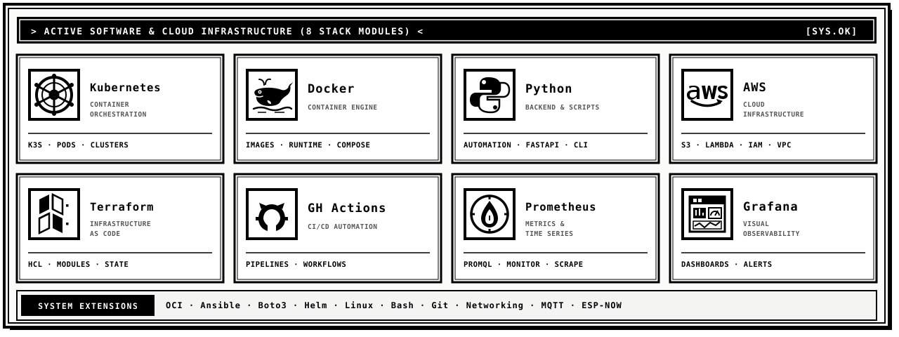
          </td>
        </tr>
        <tr>
          <td width="768">
            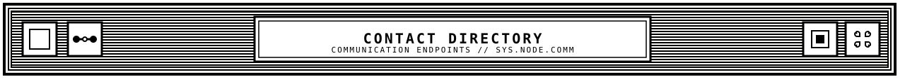
          </td>
        </tr>
        <tr>
          <td width="768">
            <table width="768" cellpadding="0" cellspacing="0" border="0">
              <tr>
                <td width="192">
                  
                </td>
                <td width="192">
                  <a href="https://x.com/shakeelsaga">
                    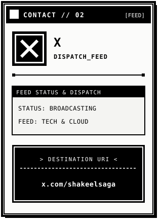
                  </a>
                </td>
                <td width="192">
                  <a href="mailto:shakeelmohammedofficial@gmail.com">
                    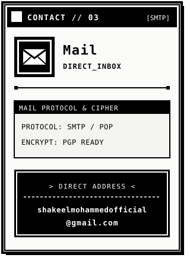
                  </a>
                </td>
                <td width="192">
                  <a href="https://leetcode.com/u/shakeelsaga/">
                    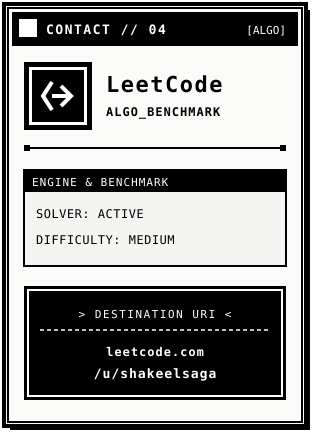
                  </a>
                </td>
              </tr>
            </table>
          </td>
        </tr>
      </table>
    </td>
  </tr>
</table>